# Kamal Youssef Portfolio - Cloudflare Architecture

This document outlines the deployment architecture for the portfolio website on Cloudflare Pages.

## Architecture Overview

```mermaid
graph TB
    %% User Layer
    U[👤 Users] --> CF[🌐 Cloudflare Edge Network]
    
    %% Cloudflare Layer
    CF --> |Global CDN| CFP[📄 Cloudflare Pages]
    CF --> |SSL/TLS| SSL[🔒 SSL Certificate]
    CF --> |Security| WAF[🛡️ Web Application Firewall]
    CF --> |Analytics| CFA[📊 Cloudflare Analytics]
    
    %% Build & Deployment
    GH[📱 GitHub Repository] --> |Webhook| CFB[⚙️ Cloudflare Build]
    CFB --> |Astro Build| DIST[📦 Static Assets]
    DIST --> CFP
    
    %% Content Sources
    MD[📝 Markdown Files] --> GH
    ASSETS[🖼️ Images & Assets] --> GH
    CODE[💻 Astro Components] --> GH
    
    %% External Integrations
    CFP --> |Fetch| GHAPI[🔗 GitHub API]
    CFP --> |Links| LIVE[🚀 Live Demos]
    
    %% Performance & Security
    CF --> |Minification| MIN[📉 Asset Optimization]
    CF --> |Caching| CACHE[⚡ Global Cache]
    CF --> |DDoS Protection| DDOS[🛡️ DDoS Protection]
    
    %% Monitoring
    CFP --> |Logs| LOGS[📋 Function Logs]
    CFP --> |Metrics| METRICS[📈 Performance Metrics]
    
    %% Custom Domain
    DOMAIN[🌐 kyoussef.com] --> CF
    
    style U fill:#e1f5fe
    style CF fill:#fff3e0
    style CFP fill:#f3e5f5
    style GH fill:#e8f5e8
    style DOMAIN fill:#fff8e1
```

## Deployment Flow

```mermaid
sequenceDiagram
    participant Dev as 👨‍💻 Developer
    participant GH as 📱 GitHub
    participant CF as ☁️ Cloudflare
    participant Edge as 🌐 Edge Network
    participant User as 👤 User
    
    Dev->>GH: Push code changes
    GH->>CF: Webhook trigger
    CF->>CF: Install dependencies
    CF->>CF: Run Astro build
    CF->>CF: Deploy to staging
    CF->>CF: Run tests (if configured)
    CF->>Edge: Deploy to production
    Edge->>Edge: Cache static assets
    User->>Edge: Request website
    Edge->>User: Serve cached content
    
    Note over CF,Edge: ~30 seconds build time
    Note over Edge,User: ~50ms response time globally
```

## Infrastructure Components

### 🌐 Cloudflare Pages
- **Static Site Hosting**: Serves pre-built Astro static files
- **Global CDN**: 200+ edge locations worldwide
- **Automatic HTTPS**: SSL/TLS certificates managed automatically
- **Custom Domains**: Support for custom domain (kyoussef.com)

### ⚙️ Build System
- **Framework**: Astro static site generator
- **Build Command**: `npm run build`
- **Output Directory**: `dist/`
- **Node Version**: 20.x
- **Build Time**: ~30-60 seconds

### 🔒 Security Features
- **WAF (Web Application Firewall)**: Protection against common attacks
- **DDoS Protection**: Automatic mitigation of attacks
- **SSL/TLS Encryption**: End-to-end encryption
- **DNSSEC**: DNS security extensions

### ⚡ Performance Optimizations
- **Global Caching**: Static assets cached at edge locations
- **Brotli Compression**: Automatic compression of text assets
- **HTTP/2 & HTTP/3**: Modern protocol support
- **Image Optimization**: Automatic image format optimization

### 📊 Monitoring & Analytics
- **Cloudflare Analytics**: Traffic and performance metrics
- **Core Web Vitals**: Performance monitoring
- **Security Events**: Attack and threat monitoring
- **Function Logs**: Build and deployment logs

## Environment Configuration

### Production Environment
- **URL**: https://kyoussef.com
- **Branch**: `main`
- **Build Command**: `npm run build`
- **Build Directory**: `dist`
- **Node Version**: 20

### Preview Environment
- **URL**: https://[branch].[project].pages.dev
- **Branch**: All branches except `main`
- **Auto-deployment**: Enabled for all pushes

## Performance Metrics

### Target Performance
- **First Contentful Paint**: < 1.5s
- **Largest Contentful Paint**: < 2.5s
- **Cumulative Layout Shift**: < 0.1
- **Time to Interactive**: < 3.5s
- **Lighthouse Score**: 95+ (all categories)

### Global Response Times
- **North America**: ~30ms
- **Europe**: ~40ms
- **Asia-Pacific**: ~60ms
- **Global Average**: ~50ms

## Scalability

### Traffic Capacity
- **Requests/month**: Unlimited on Cloudflare Pages Free
- **Bandwidth**: Unlimited
- **Build Minutes**: 500/month (Free tier)
- **Concurrent Builds**: 1 (Free tier)

### Auto-scaling Features
- **Global Load Balancing**: Automatic traffic distribution
- **Edge Caching**: Reduces origin server load
- **Rate Limiting**: Configurable request rate limits

## Disaster Recovery

### Backup Strategy
- **Source Code**: GitHub repository (primary)
- **Assets**: Stored in Git with LFS for large files
- **Build Artifacts**: Cloudflare maintains deployment history
- **Rollback**: Instant rollback to previous deployments

### High Availability
- **Uptime SLA**: 99.9% (Cloudflare Pages)
- **Multi-region**: Automatic failover across regions
- **Health Checks**: Automatic monitoring and alerting

## Cost Structure

### Cloudflare Pages (Free Tier)
- **Hosting**: $0/month
- **Bandwidth**: Unlimited
- **SSL Certificate**: Included
- **Build Minutes**: 500/month included

### Optional Add-ons
- **Cloudflare Pro**: $20/month (enhanced analytics, security)
- **Additional Build Minutes**: $5/500 minutes
- **Custom SSL**: Included in all plans

## Security Considerations

### Data Protection
- **No User Data Storage**: Static site with no backend database
- **Contact Forms**: Can integrate with Cloudflare Workers or external services
- **GDPR Compliance**: Minimal data collection

### Content Security
- **Content Security Policy**: Configurable headers
- **CORS Policy**: Controlled cross-origin requests
- **Subresource Integrity**: Automatic for external resources

---

*Last Updated: August 2025*
*Architecture Version: 1.0*